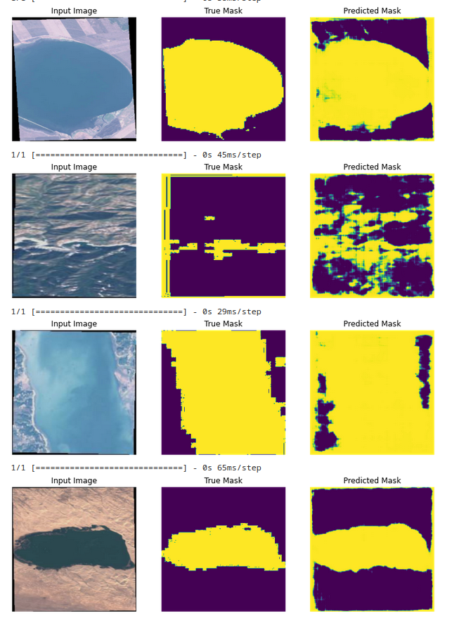

# Satellite Images Semantic Segmentation of Water Bodies using U-Net

**Semantic Segmentation**:
Semantic segmentation, or image segmentation, is the task of clustering parts of an image together which belong to the same object class. It is a form of pixel-level prediction because each pixel in an image is classified according to a category.

CNN Model Used: **U-Net Model**

#### About U-Net
https://arxiv.org/abs/1505.04597

A U-Net consists of an encoder (downsampler) and decoder (upsampler). The architecture consists of a contracting path to capture context and a symmetric expanding path that enables precise localization. We show that such a network can be trained end-to-end from very few images and outperforms the prior best method (a sliding-window convolutional network) on the ISBI challenge for segmentation of neuronal structures in electron microscopic stacks. In-order to learn robust features, and reduce the number of trainable parameters, a pretrained model is used as the encoder.The encoder is a pretrained MobileNetV2 model which is prepared and ready to use in tf.keras.applications.

Here, the U-net Model is used to perform semantic segmentation on water bodies images captured by the Sentinel-2 Satellite.

#### About Dataset:
https://www.kaggle.com/datasets/franciscoescobar/satellite-images-of-water-bodies

A collection of water bodies images captured by the Sentinel-2 Satellite. Each image comes with a black and white mask where white represents water and black represents something else but water. The masks were generated by calculating the NWDI (Normalized Water Difference Index) which is frequently used to detect and measure vegetation in satellite images, but a greater threshold was used to detect water bodies.

Reference notebook: https://www.kaggle.com/code/dikshabhati2002/image-segmentation-u-net for semantic segmenation of Cars using U-Net.

## Running the notebook
1. Upload the .ipynb file to Google Colaboratory
2. Upload your kaggle.json file to Google Colab. Follow https://www.kaggle.com/general/74235 for reference
3. Select Runtime type: GPU
4. Run the notebook

## Results

The masks are predicted with 80% accuracy after training for 14 Epochs and an early stoppage. The model is trained on a GPU. The model is saved in the .h5 format. The model can be loaded and used for predictions and can be trained for more epochs to get better results.
